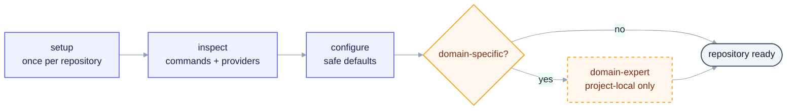
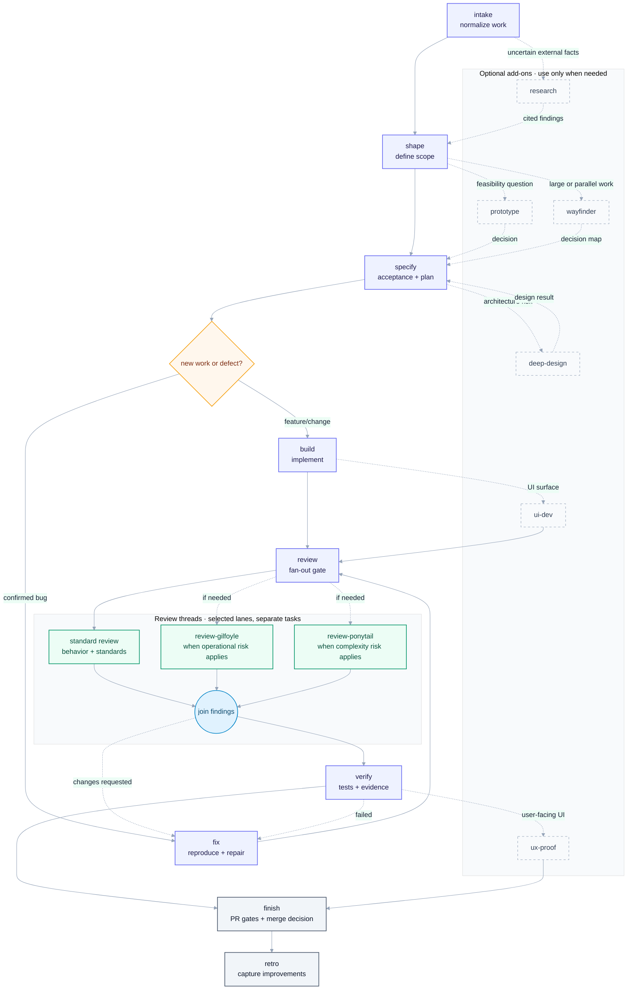

# Skills

Small, intent-based agent workflows for a normal software delivery lifecycle.

## Install in a project

Install the collection into the current project's skill directories for all
supported agents:

```bash
npx skills add igloczek/skills --skill '*' --agent '*' --yes
```

Then invoke `setup` once per project. It prepares the local workflow context;
every work item starts at `intake`.

## Skills

The core path takes work from an unclear request to a verified, merge-ready
change. Add-ons are available when the task needs research, design, UI work, or
parallel planning.

| Skill | Layer | Purpose |
| --- | --- | --- |
| `setup` | Core | Discover repository commands, documents, providers, and safe defaults. |
| `intake` | Core | Normalize a brief or issue into one actionable work item. |
| `shape` | Core | Turn a vague request into a small brief with assumptions and non-goals. |
| `specify` | Core | Produce a stable contract and the next small, dependency-aware slice. |
| `build` | Core | Implement a brief or specification with feedback and validation. |
| `fix` | Core | Reproduce, diagnose, and repair a confirmed defect with a regression check. |
| `review` | Core | Review behavior, standards, security, compatibility, tests, and complexity proportionally. |
| `verify` | Core | Verify changes with proportionate repository checks and UI evidence when needed. |
| `finish` | Core | Drive a PR through review, CI, QA, and merge gates. |
| `retro` | Core | Capture evidence-backed process improvements after delivery. |
| `prototype` | Add-on | Answer a concrete design or interaction question with disposable code. |
| `research` | Add-on | Investigate uncertain questions with cited, high-trust sources. |
| `deep-design` | Add-on | Examine boundaries, domain language, and architecture under change risk. |
| `ux-proof` | Add-on | Shape and verify user-facing changes against the local design language. |
| `wayfinder` | Add-on | Split large work into a decision map with resumable handoffs. |
| `review-gilfoyle` | Core | Review runtime reliability, observability, security, and operational risk. |
| `review-ponytail` | Core | Review over-engineering, YAGNI, and avoidable change surface. |
| `ui-dev` | Add-on | Implement interface changes with accessible states and polished interaction. |

## Setup (once per repository)

Run `setup` once for a repository. It prepares the local workflow and creates
one project-local domain expert only when domain-specific behavior needs one.



## Sample workflow

Solid arrows are the default path. Dashed arrows are optional routing based on
the work being done.



`review` always runs the standard lens and adds independent, read-only
operational and minimality lenses when the changed surface makes them useful.
Findings join before `verify`; requested changes return to implementation. The
local domain expert is consulted by `shape`, `specify`, `build`, and `review`
when relevant.

## Proportionate defaults

The default path is deliberately lightweight for a small product:

- Always prove the requested behavior with relevant tests and a focused review.
- Run UI/system evidence when the change is user-facing.
- Add coverage, complexity, mutation, architecture, or operational checks only
  when the project already has them or the change risk justifies the cost.
- Record skipped or unavailable gates; do not install an enterprise process to
  satisfy a checklist.

## Project-local domain expert

For domain-specific work, `setup` creates exactly one project-local expert from
confirmed project sources. It gives the workflow a reliable answer about
domain rules and marks missing evidence instead of guessing.

Example: in an invoicing application, a local `billing-specialist` can use
`docs/invoice-rules.md`, `src/domain/invoices/`, and `docs/tax-provider.md` to
decide whether a paid invoice may be voided, needs a credit note, or requires
specific audit fields. It does not write code or review general code quality.

## Contracts

Every mutating workflow must:

- state its inputs, outputs, side effects, and terminal states;
- preserve existing work and ask before destructive or irreversible actions;
- keep secrets out of prompts, files, comments, and reports;
- use `Status:`, `Next:`, `Spec:`, `Issue:`, and `PR:` markers when another workflow consumes the result;
- stop cleanly when a required provider, command, or artifact is missing.

`finish` never merges unless the user explicitly enables the merge action. UI
verification is evidence-based and optional for non-UI work.

## Sources

Inspired by and reusing work from:

- [open-mercato/skills](https://github.com/open-mercato/skills)
- [mattpocock/skills](https://github.com/mattpocock/skills)
- [axiomhq/gilfoyle](https://github.com/axiomhq/gilfoyle)
- [DietrichGebert/ponytail](https://github.com/DietrichGebert/ponytail)
- [Leonxlnx/taste-skill](https://github.com/Leonxlnx/taste-skill)
- [jakubkrehel/make-interfaces-feel-better](https://github.com/jakubkrehel/make-interfaces-feel-better)
