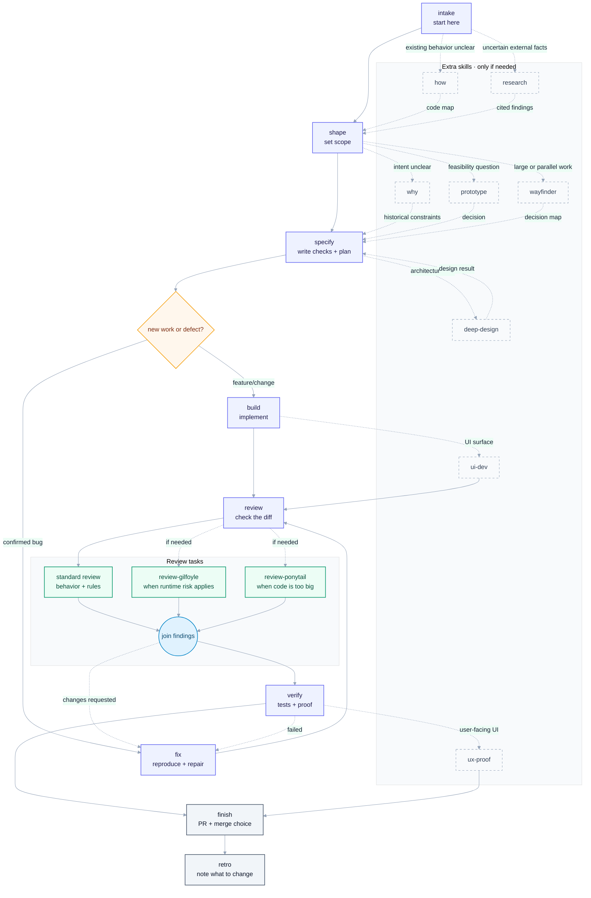

# Skills

Skills for taking a code change from request to working code.

## Purpose

I use this repo as a shared baseline workflow for a solo developer using AI
coding agents. Tools such as [Cezar](https://github.com/open-mercato/cezar) can
load these skills, put them into a predefined workflow, and run each step with
an agent.

The skills cover one code change from request to PR: understand the request,
set the scope, write a plan, change the code, review it, run checks, and finish
the PR. The runner handles execution; this repo holds the instructions for the
steps.

## Install in a project

Make the skills available to the agent runner in the project:

```bash
npx skills add igloczek/skills --skill '*' --agent '*' --yes
```

Then run `setup` once in the project. It looks at the repo and records the
commands and tools the runner should use. New work starts with `intake`.

With Cezar, these Markdown files become workflow steps. A basic chain is:

```text
intake -> shape -> specify -> build -> review -> verify -> finish
```

For a bug, I use `fix` in place of `build`. When a task needs more context or
another review, I add `how`, `why`, `research`, `review-gilfoyle`, or
`review-ponytail`.

## Skills

The Core skills are the path I use for most changes. Add-ons give a task more
context, research, design work, or another review when it needs one.

| Skill | Layer | Purpose |
| --- | --- | --- |
| `setup` | Core | Find the repo commands, docs, tools, and safe defaults. |
| `intake` | Core | Turn a brief or issue into one piece of work. |
| `shape` | Core | Make the scope, assumptions, and non-goals clear. |
| `specify` | Core | Write the acceptance checks and next small slice. |
| `build` | Core | Make the change and run feedback checks. |
| `fix` | Core | Reproduce a bug, fix it, and add a regression check. |
| `review` | Core | Look for broken behavior, security problems, compatibility issues, tests to add, and needless complexity. |
| `verify` | Core | Run the checks that matter and show what passed. |
| `finish` | Core | Handle the PR, checks, QA, and merge decision. |
| `retro` | Core | Record what should change next time. |
| `how` | Add-on | Map existing code and data flow before changing it. |
| `why` | Add-on | Use the docs, code, and history to find the likely intent. |
| `prototype` | Add-on | Answer one design or interaction question with throwaway code. |
| `research` | Add-on | Research an uncertain question and cite the sources. |
| `deep-design` | Add-on | Check how the parts fit before a risky change. |
| `ux-proof` | Add-on | Check a user-facing change against the existing UI. |
| `wayfinder` | Add-on | Break big work into smaller pieces that can be resumed. |
| `review-gilfoyle` | Core | Look for problems in running code, logs, and security. |
| `review-ponytail` | Core | Find code and dependencies to remove. |
| `ui-dev` | Add-on | Build UI changes with basic accessibility and good interaction. |

## Setup (once per repository)

Run `setup` once in a repository. It finds the commands and tools already
there. It creates one local expert when the work needs project-specific rules.


## Sample workflow

Use the solid arrows by default. Use dashed arrows only when the task needs
them.



The runner sends each box to an agent and passes the result to the next box.
`review-gilfoyle` and `review-ponytail` are extra review steps I add when a task
needs them. The project expert gives `shape`, `specify`, `build`, and `review`
the project rules they need.

## What I check

For each change, I do this:

- check the behavior that changed;
- for a UI or system change, check the UI or system too;
- add extra tests or analysis when the repo already has the tool or the change
  is risky.
- record the checks that ran and any checks left for later.

## Project-specific rules

For work with project-specific rules, `setup` can create one local expert from
the project docs and code. It tells the other skills what those rules are and
says when the evidence is missing. Code changes stay in `build` and `fix`, and
general code review stays in `review`.

Example: an invoicing project might use `docs/invoice-rules.md`,
`src/domain/invoices/`, and `docs/tax-provider.md` to answer whether a paid
invoice can be voided, needs a credit note, or needs specific fields.

## What each step records

Each skill that changes files records:

- what it reads and writes, what it can change, and how it ends;
- a request for confirmation before destructive or irreversible actions;
- prompts, files, comments, and reports stay free of secrets;
- `Status:`, `Next:`, `Spec:`, `Issue:`, and `PR:` when another skill needs the result;
- a clear stop when a required tool, command, or file is missing.

Merging stays under the user's control. UI work gets UI checks; other changes
use the checks for their code and systems.

Quality numbers are signals for changed code. The existing repo tools provide
them, and review reports a warning or a missing check separately from a failed
check. In TypeScript, new `any` needs a reason. `unknown` is used at an input
boundary and narrowed before the domain code uses it.

## Sources

Inspired by and reusing work from:

- [open-mercato/skills](https://github.com/open-mercato/skills)
- [mattpocock/skills](https://github.com/mattpocock/skills)
- [axiomhq/gilfoyle](https://github.com/axiomhq/gilfoyle)
- [DietrichGebert/ponytail](https://github.com/DietrichGebert/ponytail)
- [Leonxlnx/taste-skill](https://github.com/Leonxlnx/taste-skill)
- [jakubkrehel/make-interfaces-feel-better](https://github.com/jakubkrehel/make-interfaces-feel-better)
