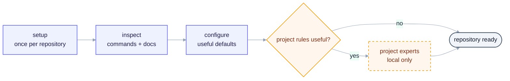
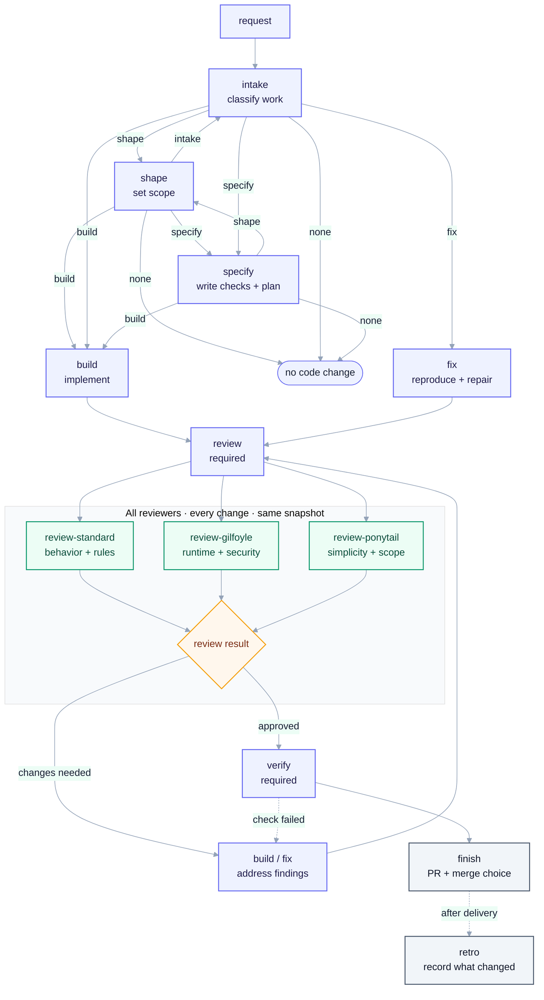

# Skills

Small skills for one developer and an AI agent. They turn a request into code,
checks, review, and a PR.

## Working style

One owner. No committee.

The agent should finish the job. Normal work needs no permission: read, edit,
run commands, install what is needed, create branches, commit, push, and open
or update PRs when the task calls for it.

Make a reasonable assumption and keep moving. Ask only for a missing credential
or decision, a destructive or irreversible action, or a real scope change. A
missing optional tool is not a blocker.

No approval theatre, fake handoffs, role gates, review limits, or security by
obscurity. Keep real validation, security, accessibility, and data-loss
protection. Use plain words, short sentences, and concrete commands. No yap.
This voice applies to every skill, report, status, comment, and handoff.

## Install

```bash
npx skills add igloczek/skills --skill '*' --agent '*' --yes
```

Run `setup` once in the project. It finds the repo commands and writes or
repairs `.ai/skills.json`.

Use the upstream CLI for external skills:

```bash
npx skills find <query>
npx skills add <source> --skill <name> --agent <agent> --yes
npx skills use <source> --skill <name>
```

This repo does not keep another registry, lockfile, version pin, installer, or
updater for external skills.

## Setup

Run `setup` once in a project. It scans the repo, writes or repairs the local
config, and makes the next run easier.



## Flow

```text
intake -> specify -> build -> review -> verify -> finish
```



- Use `shape` before `specify` or `build` when the request is fuzzy.
- Use `fix` for a bug. It follows the `build` path and adds reproduction plus a
  regression check. It is not a second delivery system.
- Use add-ons only when they help: `how`, `why`, `research`, `prototype`,
  `deep-design`, `ux-proof`, `wayfinder`, or `ui-dev`.
- `setup` repairs its own config. There is no setup-verification skill.
- Merge only when the task calls for it.

## Skills

| Skill | Type | Does |
| --- | --- | --- |
| `setup` | Core | Find repo commands and repair project config. |
| `intake` | Core | Classify the request and choose the next step. |
| `shape` | Core | Make fuzzy work clear. |
| `specify` | Core | Write the contract and next small slice. |
| `build` | Core | Implement the change and run checks. |
| `fix` | Core | Reproduce and repair a bug on the normal build path. |
| `review` | Core | Run every reviewer and join the results. |
| `review-standard` | Core | Check behavior, compatibility, security, and tests. |
| `verify` | Core | Run the checks that matter and show evidence. |
| `finish` | Core | Take the PR to the requested end state. |
| `retro` | Core | Record useful lessons after delivery. |
| `review-gilfoyle` | Core | Check runtime, operations, and security. |
| `review-ponytail` | Core | Find code and dependencies to cut. |
| `how` | Add-on | Trace existing code and data flow. |
| `why` | Add-on | Recover intent from code, docs, and history. |
| `prototype` | Add-on | Answer one design question with throwaway code. |
| `research` | Add-on | Check outside facts with sources. |
| `deep-design` | Add-on | Check module boundaries before a risky change. |
| `ux-proof` | Add-on | Check a user flow in the real UI. |
| `wayfinder` | Add-on | Split genuinely multi-session work. |
| `ui-dev` | Add-on | Build UI changes with basic accessibility. |

## Review

Every change gets every available review skill. Always run:

- `review-standard`
- `review-gilfoyle`
- `review-ponytail`

Run project-local and external reviewers too. Give them the same request,
checkout, and diff. Do not choose lanes by risk, file type, or diff size. Do not
tell an external reviewer how to do its job. Normalize only the returned output
shape.

## Setup and project rules

Project-specific rules stay in the consuming project. `setup` can create local
domain experts from local docs. They are context for the work, not a reason to
stop unrelated work. Do not copy them into this repo.

## Checks

Before delivery:

```bash
git diff --check
bun run check
```

Use project-configured checks when they exist. Warnings are warnings. Missing
optional tooling is a note, not a fake blocker.

Steps leave only what the next step needs: changed files, commands, result,
status, and next action. No process diary.

## Sources

Ideas and useful patterns came from:

- [vercel-labs/skills](https://github.com/vercel-labs/skills)
- [Cursor's pstack skills](https://github.com/cursor/plugins/tree/main/pstack)
- [open-mercato/skills](https://github.com/open-mercato/skills)
- [mattpocock/skills](https://github.com/mattpocock/skills)
- [axiomhq/gilfoyle](https://github.com/axiomhq/gilfoyle)
- [DietrichGebert/ponytail](https://github.com/DietrichGebert/ponytail)
- [Leonxlnx/taste-skill](https://github.com/Leonxlnx/taste-skill)
- [jakubkrehel/make-interfaces-feel-better](https://github.com/jakubkrehel/make-interfaces-feel-better)
