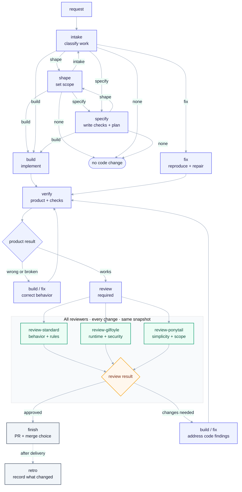

# Skills

A lightweight SDLC for solo developers and AI coding agents. It keeps the useful
engineering steps and drops the corporate process bullshit.

This is a system, not a bag of interesting tasks. A request enters the flow,
each step leaves something useful for the next one, and the flow ends with a
working, checked, reviewable PR.

## Why this exists

Many skill collections are prompt drawers. Pick a skill, run it, and work out
the rest yourself. The useful parts are there, but the handoff between them is
usually left to luck.

This repo gives the work a simple shape:

- small skills with clear jobs
- stable output for the next step
- one normal path from request to PR
- add-ons only when the work needs them
- project-specific rules kept in the project, not baked into the collection

## What is different

### Workflow first

The core is a delivery path, not a list of unrelated tricks:

```text
intake -> specify -> build -> verify -> review -> finish
```

The agent can take a request through the path and leave a working, checked,
reviewable change. `verify` comes right after code. It checks that the product
works, looks, and behaves as intended. `review` comes after that and checks the
implementation. A code review can send changed code back through `build` or
`fix`, but the changed behavior must pass `verify` again.

### External skills stay upstream

This repo does not copy what the upstream [`npx skills`](https://github.com/vercel-labs/skills)
tool already does. Discover, install, and use external skills with that CLI.
There is no local registry, pin file, updater, or lifecycle wrapper here.

### Reviews are additive

Every change gets every available review skill. The baseline is:

- `review-standard` for normal correctness;
- `review-gilfoyle` for runtime, operations, and security;
- `review-ponytail` for code and dependency bloat.

They see the same request and diff. The joiner keeps all findings and only
normalizes their output shape. It does not pick one reviewer and pretend that
is enough. Review is a code-quality pass after product verification. It can
find real implementation defects, but it does not decide what the product
should do.

### Bugs use the normal path

`fix` is `build` with a reproduction and a regression check. There is no special
bug-only loop, branch, review, or verification system.

### Setup repairs itself

`setup` inspects the project, writes or repairs `.ai/skills.json`, and reruns
its check. There is no separate setup-verification skill.

## Install

Add the public skills to a project:

```bash
npx skills add igloczek/skills --skill '*' --agent '*' --yes
```

Then run `setup` once in that project. A runner such as
[Cezar](https://github.com/open-mercato/cezar) can load the skills as workflow
steps.

For external skills, use the upstream CLI directly:

```bash
npx skills find <query>
npx skills add <source> --skill <name> --agent <agent> --yes
npx skills use <source> --skill <name>
```

## Setup

Setup is deliberately boring: inspect the repo, record useful commands and
paths, and add a local domain expert only when the project needs one.


## Workflow

Start with `intake`. From there, use the smallest path that fits the request.
`shape` and the add-ons are optional. `verify` and `review` are part of the
normal delivery path, in that order.



## Concepts

The roster is not a menu. Start at `intake`. Add-ons plug into the flow only
when they solve a real need.

### Core skills

These make up the normal path. They are useful on most changes.

### Add-ons

These answer a specific need: understand old code, check outside facts, try a
UI idea, split long work, or inspect a design seam. Do not run them just because
they exist.

### Contracts

Every public skill has a name, a short description, a workflow, and an output
shape. That is enough for a runner to pass one step to the next without making
each agent rediscover the whole process.

### Project-local context

The collection stays generic. Repo-specific commands, paths, provider details,
and domain rules live in the consuming project. `setup` can create local domain
experts from that project's own docs.

## Skill roster

### Core

| Skill             | Does                                                 |
| ----------------- | ---------------------------------------------------- |
| `build`           | Implement the change and run checks.                 |
| `finish`          | Take the PR to the requested end state.              |
| `fix`             | Reproduce and repair a bug on the normal build path. |
| `intake`          | Classify the request and choose the next step.       |
| `retro`           | Record useful lessons after delivery.                |
| `review-gilfoyle` | Check runtime, operations, and security.             |
| `review-ponytail` | Find code and dependencies to cut.                   |
| `review-standard` | Check behavior, compatibility, security, and tests.  |
| `review`          | Run every reviewer after product verification.       |
| `setup`           | Find repo commands and repair project config.        |
| `shape`           | Make fuzzy work clear.                               |
| `specify`         | Write the contract and next small slice.             |
| `verify`          | Prove the product works before code review.          |

### Add-ons

| Skill         | Does                                            |
| ------------- | ----------------------------------------------- |
| `deep-design` | Check module boundaries before a risky change.  |
| `how`         | Trace existing code and data flow.              |
| `prototype`   | Answer one design question with throwaway code. |
| `research`    | Check outside facts with sources.               |
| `ui-dev`      | Build UI changes with basic accessibility.      |
| `ux-proof`    | Check a user flow in the real UI.               |
| `wayfinder`   | Split genuinely multi-session work.             |
| `why`         | Recover intent from code, docs, and history.    |

## Sources

Ideas and useful patterns came from:

- [Cursor's pstack skills](https://github.com/cursor/plugins/tree/main/pstack)
- [open-mercato/skills](https://github.com/open-mercato/skills)
- [mattpocock/skills](https://github.com/mattpocock/skills)
- [axiomhq/gilfoyle](https://github.com/axiomhq/gilfoyle)
- [DietrichGebert/ponytail](https://github.com/DietrichGebert/ponytail)
- [Leonxlnx/taste-skill](https://github.com/Leonxlnx/taste-skill)
- [jakubkrehel/make-interfaces-feel-better](https://github.com/jakubkrehel/make-interfaces-feel-better)
