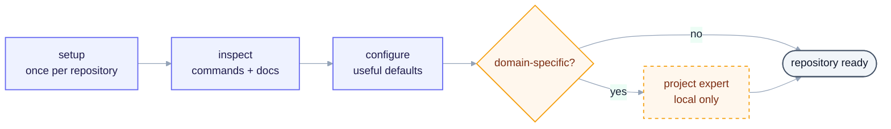
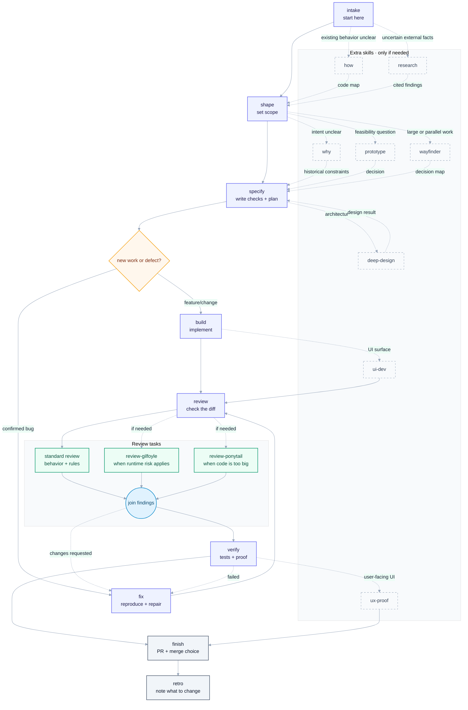

# Skills

Skills for taking a code change from request to working code.

## Purpose

This repo contains skills for a solo developer using an AI coding agent. They
cover the basic work: understand the request, keep the change small, write the
code, review it, run the right checks, and finish the PR.

This is not a company process, compliance tool, test runner, or replacement for
the tools already in a project. Do not use every skill on every task. Use the
shortest path that is safe for the change. Add more checks when the change is
risky or unclear. See [AGENTS.md](AGENTS.md) when changing this repo.

## Install in a project

Install the skills in the current project:

```bash
npx skills add igloczek/skills --skill '*' --agent '*' --yes
```

Then run `setup` once in the project. It looks at the repo and records the
commands and tools the agent should use. New work starts with `intake`.

## Skills

The core path turns a request into a small change, makes it, checks it, and
finishes it. Use the add-ons when the code, intent, UI, or task is harder to
understand.

| Skill | Layer | Purpose |
| --- | --- | --- |
| `setup` | Core | Find the repo commands, docs, tools, and safe defaults. |
| `intake` | Core | Turn a brief or issue into one piece of work. |
| `shape` | Core | Make the scope, assumptions, and non-goals clear. |
| `specify` | Core | Write the acceptance checks and next small slice. |
| `build` | Core | Make the change and run feedback checks. |
| `fix` | Core | Reproduce a bug, fix it, and add a regression check. |
| `review` | Core | Look for broken behavior, security problems, compatibility issues, missing tests, and needless complexity. |
| `verify` | Core | Run the checks that matter and show what passed. |
| `finish` | Core | Handle the PR, checks, QA, and merge decision. |
| `retro` | Core | Record what should change next time. |
| `how` | Add-on | Map existing code and data flow before changing it. |
| `why` | Add-on | Use the docs, code, and history to find the likely intent. |
| `prototype` | Add-on | Answer one design or interaction question with throwaway code. |
| `research` | Add-on | Research an uncertain question and cite the sources. |
| `deep-design` | Add-on | Check how the parts fit before a risky change. |
| `ux-proof` | Add-on | Check a user-facing change against the existing UI. |
| `wayfinder` | Add-on | Break big work into smaller pieces that can be resumed. |
| `review-gilfoyle` | Core | Look for problems in running code, logs, and security. |
| `review-ponytail` | Core | Look for code and dependencies we do not need. |
| `ui-dev` | Add-on | Build UI changes with basic accessibility and good interaction. |

## Setup (once per repository)

Run `setup` once in a repository. It finds the commands and tools already
there. It creates one local expert only when the work needs project-specific
rules.



## Sample workflow

Use the solid arrows by default. Use dashed arrows only when the task needs
them.



`review` always runs the standard review. It adds the runtime and simplicity
reviews only when they can find something useful. The findings are combined
before `verify`. If review finds a problem, go back to `build` or `fix`. The
project expert is used by `shape`, `specify`, `build`, and `review` when its
rules matter.

## Default rules

Keep the default path small:

- Check the behavior that changed.
- For a UI or system change, check the UI or system too.
- Add extra tests or analysis when the repo already has the tool or the change
  is risky.
- Say when a check was skipped or could not run. Do not add a large process just
  to tick a box.

## Project-specific rules

For work with project-specific rules, `setup` can create one local expert from
the project docs and code. It tells the other skills what those rules are and
says when the evidence is missing. It does not write code or review general
code quality.

Example: an invoicing project might use `docs/invoice-rules.md`,
`src/domain/invoices/`, and `docs/tax-provider.md` to answer whether a paid
invoice can be voided, needs a credit note, or needs specific fields.

## Contracts

Every skill that changes files must:

- say what it reads and writes, what it can change, and how it ends;
- not erase or overwrite work without asking;
- keep secrets out of prompts, files, comments, and reports;
- use `Status:`, `Next:`, `Spec:`, `Issue:`, and `PR:` when another skill needs the result;
- stop if a required tool, command, or file is missing.

`finish` never merges unless the user explicitly allows it. UI checks are
optional for non-UI work.

Quality numbers are hints for changed code, not a cleanup project. Use tools
already in the repo. Report a warning or a missing check instead of making it a
failure by default. In TypeScript, do not add new `any` without a reason.
`unknown` is fine at an input boundary if the code checks it before using it.

## Sources

Inspired by and reusing work from:

- [open-mercato/skills](https://github.com/open-mercato/skills)
- [mattpocock/skills](https://github.com/mattpocock/skills)
- [axiomhq/gilfoyle](https://github.com/axiomhq/gilfoyle)
- [DietrichGebert/ponytail](https://github.com/DietrichGebert/ponytail)
- [Leonxlnx/taste-skill](https://github.com/Leonxlnx/taste-skill)
- [jakubkrehel/make-interfaces-feel-better](https://github.com/jakubkrehel/make-interfaces-feel-better)
