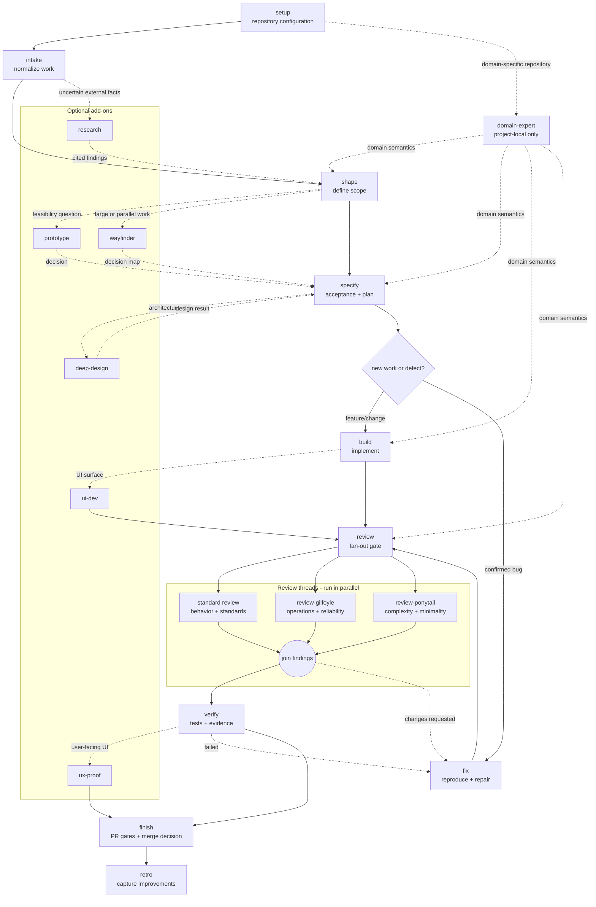

# Skills

Small, intent-based agent workflows for a normal software delivery lifecycle.

## Install once

Install the collection into the global skill directory of your agent (or use
the installer's global option when it is available):

```bash
npx skills add igloczek/skills --skill '*'
```

Projects may still need a small local `.ai/skills.json` for their own commands,
tracker, or browser provider. That is project configuration, not a second skill
installation.

## Shape

The current collection contains:

| Layer | Entry points | Purpose |
| --- | ---: | --- |
| Core | 12 | The default SDLC menu: `setup`, `shape`, `intake`, `specify`, `build`, `fix`, `review`, `review-gilfoyle`, `review-ponytail`, `verify`, `finish`, `retro`. |
| Add-ons | 6 | `prototype`, `research`, `deep-design`, `ux-proof`, `wayfinder`, `ui-dev`; load only when the task needs them. |
| Internal | 9 | Shared primitives in [`internal/PRIMITIVES.md`](internal/PRIMITIVES.md); the local domain-expert contract in [`internal/DOMAIN-EXPERT.md`](internal/DOMAIN-EXPERT.md), intentionally not an installable skill. |

Modes such as autonomous, loop, resume, batch, dry-run, and tracker-less are
parameters of a workflow. They are not separate skills.

## Skill catalog

| Skill | Layer | Purpose |
| --- | --- | --- |
| `setup` | Core | Discover repository commands, documents, providers, and safe defaults. |
| `intake` | Core | Normalize a brief or issue into one actionable work item. |
| `shape` | Core | Turn a vague request into a small brief with assumptions and non-goals. |
| `specify` | Core | Produce an implementation-ready specification and dependency-aware plan. |
| `build` | Core | Implement a brief or specification with feedback and validation. |
| `fix` | Core | Reproduce, diagnose, and repair a confirmed defect with a regression check. |
| `review` | Core | Review behavior, standards, security, compatibility, tests, and complexity. |
| `verify` | Core | Verify changes with repository checks and UI evidence when needed. |
| `finish` | Core | Drive a PR through review, CI, QA, and merge gates. |
| `retro` | Core | Capture evidence-backed process improvements after delivery. |
| `prototype` | Add-on | Answer a concrete design or interaction question with disposable code. |
| `research` | Add-on | Investigate uncertain questions with cited, high-trust sources. |
| `deep-design` | Add-on | Examine boundaries, domain language, and architecture under change risk. |
| `ux-proof` | Add-on | Shape and verify user-facing changes against the local design language. |
| `wayfinder` | Add-on | Split large work into a decision map with resumable handoffs. |
| `review-gilfoyle` | Core | Review runtime reliability, observability, security, and operational risk. |
| `review-ponytail` | Core | Review over-engineering, YAGNI, and avoidable change surface. |
| `ui-dev` | Add-on | Implement interface changes with accessible states and polished interaction. |

## Sample workflow

Solid arrows are the default path. Dashed arrows are optional routing based on
the work being done.



`review` launches the three review threads in parallel. Each thread is
read-only and returns its own findings; the join happens before `verify`.
Changes requested by any lane return to implementation instead of being hidden
inside one combined review.

## Project-local domain expert

`setup` creates exactly one project-local domain expert from confirmed sources
when domain-specific behavior requires it; for example, a project may create a
local `nutritionist`. That expert is not shipped or installable from this
repository. Its contract is in [`internal/DOMAIN-EXPERT.md`](internal/DOMAIN-EXPERT.md),
with the setup template in
[`skills/setup/references/domain-expert.md`](skills/setup/references/domain-expert.md).

## Contracts

Every mutating workflow must:

- state its inputs, outputs, side effects, and terminal states;
- preserve existing work and ask before destructive or irreversible actions;
- keep secrets out of prompts, files, comments, and reports;
- use `Status:`, `Next:`, `Spec:`, `Issue:`, and `PR:` markers when another workflow consumes the result;
- stop cleanly when a required provider, command, or artifact is missing.

`finish` never merges unless the user explicitly enables the merge action. UI
verification is evidence-based and optional for non-UI work.

## Contributing

Before adding a skill, prove that an existing entry point or add-on cannot own
the intent. Prefer a mode, reference, or internal primitive. New public skills
must add a distinct user-visible capability, a clear output contract, and a
small check in `scripts/check.cjs` if the structure changes.

Run:

```bash
npm run check
```

## Sources

This collection uses or is inspired by:

- [open-mercato/skills](https://github.com/open-mercato/skills)
- [mattpocock/skills](https://github.com/mattpocock/skills)
- [axiomhq/gilfoyle](https://github.com/axiomhq/gilfoyle)
- [DietrichGebert/ponytail](https://github.com/DietrichGebert/ponytail)
- [Leonxlnx/taste-skill](https://github.com/Leonxlnx/taste-skill)
- [jakubkrehel/make-interfaces-feel-better](https://github.com/jakubkrehel/make-interfaces-feel-better)

External skill instructions remain external dependencies; this repository
references their capabilities without bundling their skill files.
